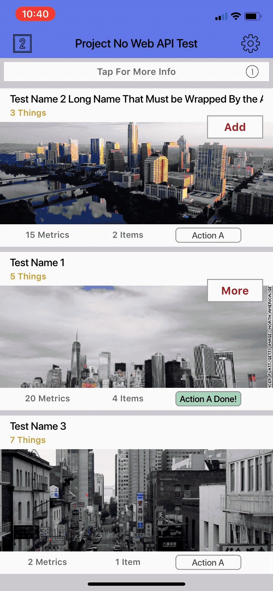

# Generic iOS App

I co-created a services platform for businesses to use IoT devices in their storefronts.  
As of late 2019 I've stopped working on this project. A lot of technical work was done for it, part of it was an iOS iPhone App I wrote. I've decided to open-source a generic version of the app and keep the BLE capability.

The IoT technology that this app uses are BLE iBeacons, see [Apple's docs](https://developer.apple.com/ibeacon/). If you don't own a beacon, you can still run this app with test data that is included.

# Demo

<table>
  
Recording of the app working on an iPhone (iOS 13.4.1)  (placeholder data is populating the views)

  <tr>
    <th> Onboarding </th>
    <th> Multi-Action Cells </th>
    <th> Detailed Cell Actions</th>
  </tr>
  <tr>
    <th>
      
    </th>
    <th>
      
    </th>
    <th>
      
    </th>
  </tr>
  <tr>
    <th>Second View Presentation</th>
    <th>Settings</th>
  </tr>
  <tr>
    <th>
      
    </th>
    <th>
      
    </th>
  </tr>
</table>

 

# Getting Started

## State of the App
When you clone the app, the debugging flag `-D NO_WEB_API_TESTING` will be set.  
With this flag on, the web API logic is substitued with fake data hardcoded in the debugging module.  
See **./Debugging/README.md** for more info on debugging modes and fake data being used. 

## Build 
- Swift Version: 4
- Last build with Xcode 11.4
- Deployment Target: iOS 11.0, tested with up to iOS 13.4

## Dependencies
The only dependecies for this app come from [Cocoapods](https://cocoapods.org). To ease with portability, the source files are included in this repo.

